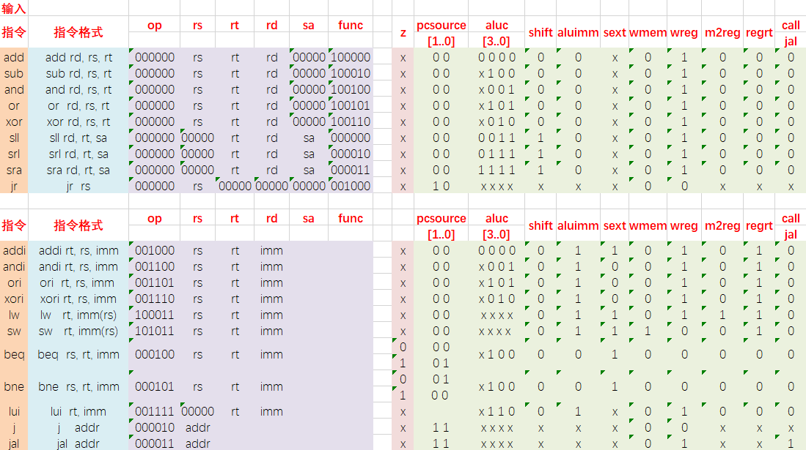
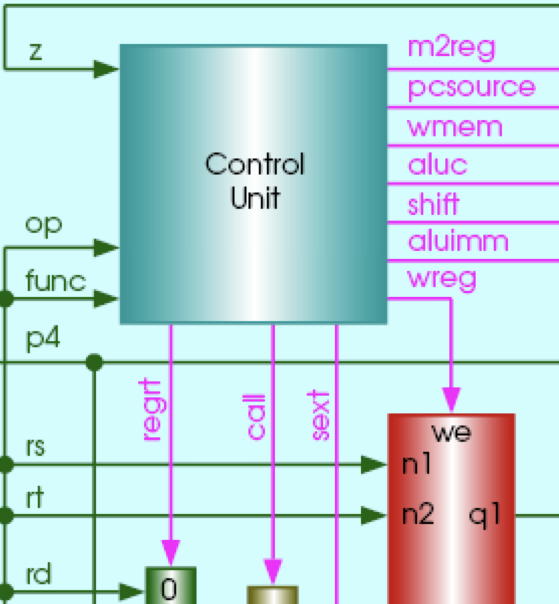
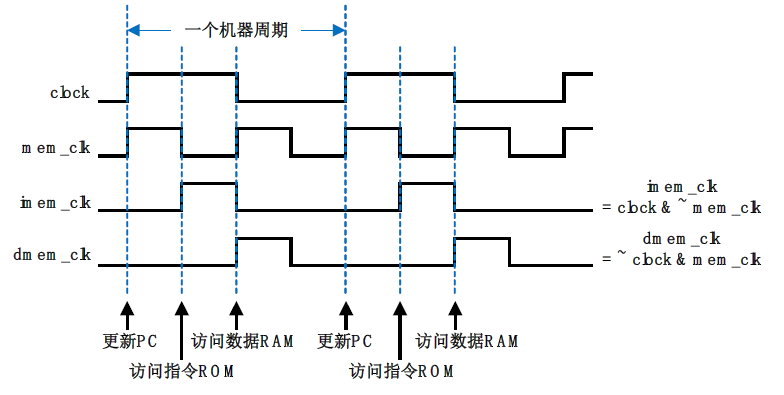
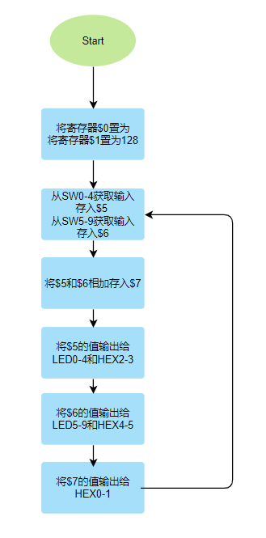

# 单周期CPU设计

## 1. 实验目的

1. 理解计算机5大组成部分的协调工作原理，理解存储程序自动执行的原理。
2. 掌握运算器、存储器、控制器的设计和实现原理。重点掌握控制器设计原理和实现方法。
3. 掌握I/O端口的设计方法，理解I/O地址空间的设计方法。
4. 会通过设计I/O端口与外部设备进行信息交互


## 2. 实验结果概述

实现了支持20条MIPS指令的单周期CPU，并支持I/O读写。通过编写汇编代码，实现了简单的计算器（加法）。通过SW部件输入加数，使用二进制输入，`SW0-SW4`和`SW5-SW9`分别表示5-bit的加数（无符号），通过读取SW的值，将其显示在数码管和十个LED灯上。若`SXi`为1，则`LEDi`为亮，表示二进制值为1。数码管`HEX4-HEX5`以十进制显示显示`SW5-SW9`的值，数码管`HEX2-HEX3`以十进制显示显示`SW0-SW4`的值，并将两数相加结果显示在数码管`HEX0-HEX1`上。


## 3. 单周期CPU设计

### 3.1 真值表填写

* `z`: 表示alu计算结果是否为0，只有`beq`和`bne`指令会使用到，所以其他均为`x`

* `pcsource`：`pcsource`的值决定了多路选择器将选择哪一路作为下一条`pc`的值

  * 0：选择`pc+4`
  * 1：选择`pc+4+imm<<2`。当指令为`beq`,`bne`且分别满足`rs==rt`，`rs!=rt`时选择
  * 2：选择寄存器`q1`的值。当指令为`jr`时选择
  * 3：选择`(pc+4)[31..28],addr<<2`，当指令为`j`,`jal`时选择

* `alu`：根据指令所需要的运算进行赋值

  |  值  |                操作                |
  | :--: | :--------------------------------: |
  | x000 |                ADD                 |
  | x100 |                SUB                 |
  | x001 |                AND                 |
  | x101 |                 OR                 |
  | x010 |                XOR                 |
  | x110 |         LUI: imm << 16bit          |
  | 0011 |       SLL: rd <- (rt << sa)        |
  | 0111 |  SRL: rd <- (rt >> sa) (logical)   |
  | 1111 | SRA: rd <- (rt >> sa) (arithmetic) |

* `shift`：决定二路选择器选择`alu`的一个运算数，为0选择寄存器，为1选择`sa`。只有在移位操作时为1。

* `aluimm`：决定二路选择器选择`alu`的一个运算数，为0选择寄存器，为1选择`imm`。

* `sext`：决定`imm`是否有符号，`adi`,`ori`,`xori`为无符号。

* `wmem`：控制存储器是读还是写。

* `wreg`：控制`regfile`是读寄存器还是写。

* `m2reg`：控制是否将存储器的读出值写入`regfile`，只有`lw`时为1。

* `regrt`：选择寄存器为`rt`还是`rd`

* `call`：控制一个模块`f`和一个二路选择器，如果值为1，则`f`抛弃位于`f`之前的二路选择器选择出来的寄存器（`rt`和`rd`），而使用寄存器`$31`。同时控制另一个二路选择器，选择写入`regfile`的值来自`pc+4`，还是`alu`或者是存储器的结果。只有指令为`jal`时值才为1。




### 3.2 控制器设计

控制器的逻辑位于代码`source/sc_cu.v`



控制器的作用就是根据输入信号`op`,`func`和`z`，计算出`wmem, wreg, regrt, m2reg, aluc, shift, aluimm, pcsource, jal, sext`信号的值。

先根据`op`和`func`的值计算出这是什么指令，载根据真值表得到相应输出信号的值。

```verilog
assign pcsource[1] = i_jr | i_j | i_jal;
assign pcsource[0] = ( i_beq & z ) | (i_bne & ~z) | i_j | i_jal ;
assign wreg = i_add | i_sub | i_and | i_or   | i_xor  |
                 i_sll | i_srl | i_sra | i_addi | i_andi |
                 i_ori | i_xori | i_lw | i_lui  | i_jal;
   
assign aluc[3] = i_sra;
assign aluc[2] = i_sub | i_or | i_srl | i_sra | i_ori | i_lui | i_beq | i_bne;
assign aluc[1] = i_xor | i_sll | i_srl | i_sra | i_xori | i_lui;
assign aluc[0] = i_or | i_sll | i_srl | i_sra | i_ori | i_and | i_andi;
assign shift   = i_sll | i_srl | i_sra ;
	
assign aluimm  = i_addi | i_andi | i_ori | i_xori | i_lw | i_sw | i_lui;
assign sext    = i_addi | i_lw | i_sw | i_beq | i_bne;
assign wmem    = i_sw;
assign m2reg   = i_lw;
assign regrt   = i_addi | i_andi | i_ori | i_xori | i_lw | i_lui;
assign jal     = i_jal;
```


### 3.2 运算器设计

根据`3.1`的表格，写相应`case`语句，进行相应运算。

注意要改变`z`的值

```verilog
 casex (aluc)
             4'bx000: s = a + b;              //x000 ADD
             4'bx100: s = a - b;              //x100 SUB
             4'bx001: s = a & b;              //x001 AND
             4'bx101: s = a | b;              //x101 OR
             4'bx010: s = a ^ b;              //x010 XOR
             4'bx110: s = a << 16;            //x110 LUI: imm << 16bit
             4'b0011: s = b << a;             //0011 SLL: rd <- (rt << sa)
             4'b0111: s = b >> a;             //0111 SRL: rd <- (rt >> sa) (logical)
             4'b1111: s = $signed(b) >>> a;   //1111 SRA: rd <- (rt >> sa) (arithmetic)
             default: s = 0;
         endcase
         if (s == 0 )  z = 1;
            else z = 0;         
```


### 3.4 时钟设计

`DE1-SOC`实验板上`Altera`的`CycloneⅤ`系列`FPGA`器件中，只提供同步ROM和同步RAM宏模块。当同步ROM或RAM接收到数据地址时，不同于异步器件在经过一段组合电路的反应延迟后送出数据，同步器件需要等到同步时钟信号clock上升沿时才真正送出数据（这就可以使延迟时间不尽相同的多个器件在输出级达成一致）。

同步RAM在接收到地址后，在wren信号高有效期间，需要等到同步时钟clock上升沿，才开始写动作，并将要写入的新数据马上输出到q输出端，即在写时可以同时读输出，并在同步时钟clock的下降沿将数据真正写入到存储器中。

对于采用有同步信号的指令同步ROM、数据同步RAM，在一个CPU指令周期内，需要安排更精细的时钟信号来协调它们的顺序工作过程。为此，实验中设计了2路时钟信号，一路为表征机器周期的clock时钟信号，另一路为clock时钟信号2倍频的`mem_clk`时钟信号。事实上，在实现中，clock是`mem_clk`信号的2分频信号，分频比倍频在电路上要容易实现的多。




此次实验中我更改了`sc_computer`的输入信号，使用一个`50MHZ`的时钟信号作为输入，再实现了一个二分频部件`clock_and_mem_clock`，得到为`50MHZ`的时钟`mem_clk`和`25MHZ`的`clock`信号。就满足了以上要求。

```verilog
module clock_and_mem_clock(
	clock_in,
	clock_out,mem_clock
);

	input clock_in;
	output reg clock_out; 
	output mem_clock;
	
	assign mem_clock = clock_in;
	
	initial
	begin
		clock_out <= 0;
	end
	
	always @ (posedge clock_in)
	begin
		clock_out <= ~clock_out;
	end
	
endmodule
```


## 4. I/O设计

### 4.1 地址设计

在以上实现的类MIPS指令系统CPU设计基础上，采用I/O地址和主存统一编址的方式，即将输入输出的I/O地址空间，作为主存数据存取空间的一部分，实现CPU与外部设备的输入输出端口设计。对I/O端口的访问，采用同访问`MEM`一样的`Lw`指令和`Sw`指令，由硬件通过对地址的识别区分，实现对`MEM`访问和I/O访问的区分。

```verilog
   assign         dram_write_enable = we & ~clock & ~addr[7];
   assign         io_write_enable = we & ~clock & addr[7];
   assign         dataout = addr[7] ? io_out : mem_out;
```

如上，我将`addr`的第7位作为区分主存寻址和I/O设备寻址的区分标志，如果`addr[7]`位1，则说明该地址为外部设备，为0则说明是主存。

此次实验中需要的外部设备有SW，LED灯，数码管。我为他们如下分配地址。

| 地址(addr[6:2]) | 32位地址 |       变量        |   元件    |          作用          |
| :-------------: | :------: | :---------------: | :-------: | :--------------------: |
|        0        |  128(0)  | io_out_hex[13:0]  | HEX0,HEX1 |      显示相加结果      |
|        1        |  132(4)  | io_out_hex[27:14] | HEX2,HEX3 |     显示第二个加数     |
|        2        |  136(8)  | io_out_hex[41:28] | HEX4,HEX5 |     显示第二个加数     |
|        3        | 140(12)  |  io_out_led[4:0]  | LED4-LED0 | 显示第二个加数的二进制 |
|        4        | 144(16)  |  io_out_led[9:5]  | LED9-LED5 | 显示第一个加数的二进制 |
|        5        | 148(20)  |   io_in_sw[4:0]   |  SW0-SW4  |     输入第二个加数     |
|        6        | 152(24)  |   io_in_sw[9:5]   |  SW5-SW9  |     输入第一个加数     |
|        7        | 156(28)  |   io_in_sw[7:0]   |  SW0-SW7  |                        |
|        8        | 160(32)  |  io_out_led[7:0]  |           |                        |


### 4.2 I/O读写逻辑设计

利用设计的I/O端口，通过`lw`指令，输入实验板上的按键输入信息。将外部设备的状态或数据输入，读入到CPU内部寄存器。

利用设计的I/O端口，通过`sw`指令，输出对实验板上的LED灯和数码管的控制信号（或数据信息）。即将对外部设备的控制数据，从CPU内部的寄存器，写入到外部设备的相应控制寄存器（该控制寄存器输出，可直接连接输出至外部设备，作为对外部设备的控制输入信号）。

```verilog
always @ (posedge clock) begin
		  
		  if (write_enable) begin
            case (addr)
                0: io_out_hex[13:0] = hexs;     // led hex0, hex1
                1: io_out_hex[27:14] = hexs;   // led hex2, hex3
                2: io_out_hex[41:28] = hexs;   // led hex4, hex3
					 3: io_out_led[4:0] = data_in[4:0];
					 4: io_out_led[9:5] = data_in[4:0];
                default:
						begin
						io_out_led = 10'b1111111111;  // all leds off
						io_out_hex = 0	;	// all hexs off
						end
            endcase
        end

        case (addr)
            5: data_out = {27'b0, io_in_sw[4:0]};    // switch 0-4
            6: data_out = {27'b0, io_in_sw[9:5]};    // switch 5-9
       
				default: data_out = 0;
        endcase
    end
```


## 5. 汇编程序设计

### 5.1 程序功能

通过SW部件输入加数，使用二进制输入，`SW0-SW4`和`SW5-SW9`分别表示5-bit的加数（无符号），通过读取SW的值，将其显示在数码管和十个LED灯上。若`SXi`为1，则`LEDi`为亮，表示二进制值为1。数码管`HEX4-HEX5`以十进制显示显示`SW5-SW9`的值，数码管`HEX2-HEX3`以十进制显示显示`SW0-SW4`的值，并将两数相加结果显示在数码管`HEX0-HEX1`上。

不断循环。

### 5.2 汇编程序以及流程图

需要将自己写的MIPS汇编文件通过`MIPS translate`(汇编器)，转化成输出`.mif` （Memory Initialization File）文件，该文件用于指定内存布局。该汇编器将MIPS汇编程序转换为指令内存的`mif `布局文件，若所写的程序还要求数据内存中预先存在特定的数据，则需要自行编写相应的`mif` 文件。

在实例化器件`lpm_rom_irom`中设定ROM的初始化文件：

```verilog
altsyncram_component.init_file = "./source/sc_code.mif"
```

在实例化器件`lpm_ram_dq_dram`中设定ROM的初始化文件：

```verilog
altsyncram_component.init_file = "./source/sc_datamem.mif"
```


自行编写的汇编代码如下：

```assembly
xor $0 $0 $0
addi $1 $0 128 	# $1 = 128	 
lw $5 $1 20     # $5 <- addr(128+20) 	SW0-4  
lw $6 $1 24     # $6 <- addr(128+24)  	SW5-9 
add $7 $5 $6    # $7 = $5 + $6   
sw $5 $1 4      # $5 -> addr(128+4)     HEX2,HEX3
sw $5 $1 12		# $5 -> addr(128+12)    LED0-4
sw $6 $1 8      # $6 -> addr(128+8)     HEX4,HEX5  
sw $6 $1 16		# $6 -> addr(128+16)    LED5-9
sw $7 $1 0      # $7 -> addr(128+0)     HEX0,HEX1  
j 2
```




## 6. 仿真

