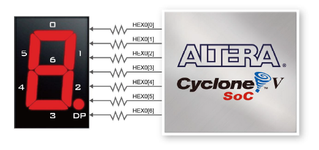
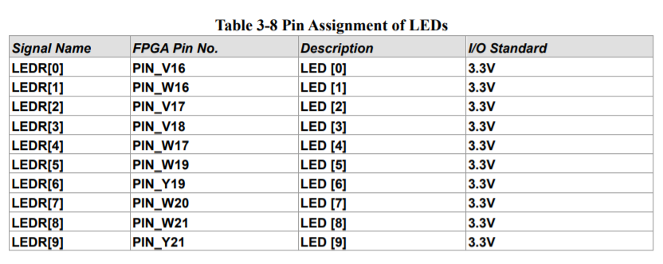
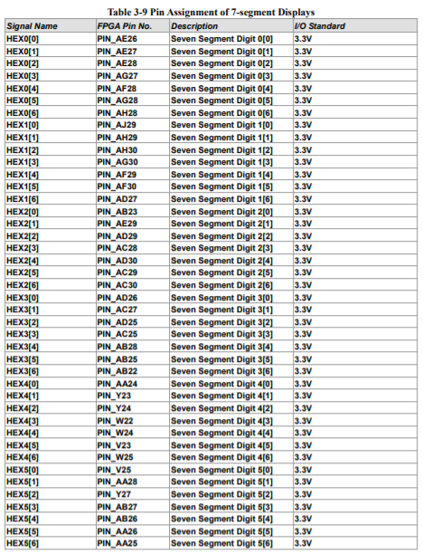
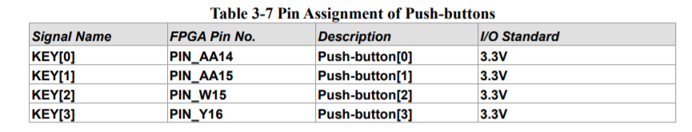

# 基于Verilog和FPGA的多功能秒表设计

刘书畅 518021910789

------

## 实验目的

1.  初步掌握利用Verilog硬件描述语言进行逻辑功能设计的原理和方法

2.  理解和掌握运用大规模可编程逻辑器件进行逻辑设计的原理和方法

3.  理解硬件实现方法中的并行性，联系软件实现方法中的并发性

4. 理解硬件和软件是相辅相成、并在设计和应用方法上的优势互补的特点

5. 本实验学习积累的Verilog硬件描述语言和对FPGA/CPLD的编程操作，是进行后续《计算机组成原理》部分课程实验，设计实现计算机逻辑的基础

   

## 设计思路

由于这是本人第一次接触相关实验，所以采取先减后繁，逐步迭代的设计思路。先实现简单的控制数码管显示，并亮起相应数字，再实现时间计数功能。当完成基础功能后逐步加上按键功能，LED灯功能。最后增加按键消抖。

### 1. 数码管显示

一个数字由七根数码管组成，所以需要7个bit控制。使用case语句，进行不同数字到数码管亮暗的转换。1表示暗，0表示亮。

数码管的不同管的亮暗由不同bit控制



### 2. 时间计数功能设计

因为DE1-SOC板上的时钟为50MHz，所以需要500000次20ns之后，才是10ms。

而要求设计的秒表需要精确到10ms，所以我们使用变量`counter_50M`进行计数，每次时钟上升沿将计数器加一，当计数器的值为500000时，说明时间累积10ms，相应增加`msecond_display_low`的值。

为了数码管同时改变值，和为之后的暂停显示功能做准备，我们区分计数寄存器和显示寄存器，`XXX_counter_high/low`用于计数，`XXX_display_high/low`用于显示，若需要显示当前时间，则把计数值赋值给显示值。

不同时间位之间的进制不同。`msecond_counter_low`满10，`msecond_counter_high`加一；`msecond_counter_high`满10，`second_counter_low`加一；`second_counter_low`满10，`second_counter_high`加一;`second_counter_high`满6，`minute_counter_low`加一；`minute_counter_low`满10，`minute_counter_high`加一。


### 3. 按键功能设计

按照需求，我们需要设计三个按键，分别为“计时复位”、“计数/暂停”、“显示暂停/显示继续”。我们采用`KEY0`控制计时复位，用`KEY1`控制计数/暂停，用`KEY2`控制显示暂停/显示继续。

按键按下信号为0。

使用`reset_time`表示是否需要复位，若为1则将`XXX_counter_high/low`和计数器`counter_50M`均置为0，并赋值给`XXX_display_high/low`。

使用`start`表示是否开始计时。只有`start`为1时才改变`XXX_counter_high/low`的值。

使用`display`表示是否开始显示。只有`display`的值为1时，才将`XXX_counter_high/low`赋值给`XXX_display_high/low`。


### 4. LED灯设计

`LEDR0`表示“计时复位”按键是否按下，`LEDR1`表示“计数/暂停”按键是否按下，`LEDR2`表示“显示暂停/显示继续”按键是否按下。按键按下LED灯为暗。


### 5. 按键消抖

按键按下的理想状态波形应该如图所示，但由于人手的不精确以及材料的形变回弹等等原因，往往不能达到理想情况。


按键消抖的总体思路为忽略抖动时的信号变化。

此处我进行按键消抖的思路为，当按键按下时开始计数，当持续有`8'b11111111`次，按键信号为按下时，表示按键真的按下，修改相应`reset_time`,`start`,`display`的值。当按键松开时开始计数，当持续有`8'b11111111`次，按键信号为松开时，表示按键真的松开。

由于`reset`操作较开始和显示简单，所以松开按键不做计数。


## 代码说明

一下对关键代码进行说明

### 1. 时间计数

每次时钟上升沿增加计数器`counter_50M`的值，当`if(counter_50M == 500000) `时，说明累积10ms，逐级判断进位。

```verilog
if(start)
	begin
	counter_50M = counter_50M + 1;
		if(counter_50M == 500000) 
		begin
		counter_50M = 0;
		msecond_counter_low = msecond_counter_low + 1; 
			if(msecond_counter_low == 10)
			begin
			msecond_counter_high = msecond_counter_high + 1;
			msecond_counter_low = 0;
		
				if(msecond_counter_high == 10)
				begin
				msecond_counter_high = 0;
				second_counter_low = second_counter_low +1;
			
					if(second_counter_low == 10)
					begin
					second_counter_low = 0;
					second_counter_high = second_counter_high +1;
				
						if(second_counter_high == 6)
						begin
						minute_counter_low = minute_counter_low +1;
						second_counter_high =0;
					
							if(minute_counter_low == 10)
							begin
							minute_counter_low = 0;
							minute_counter_high = minute_counter_high +1;
						
								if(minute_counter_high ==6)
								minute_counter_high = 0;
							end
						end
					end
				end 
			end 
		end
	end 
```


### 2. 按键消抖

此处以“计数/暂停”的按键消抖为例。

当按键完成按下并松开这一动作时，才视为一次成功按键操作，转换`start`状态。

`start_time`变量用于按键消抖状态转换，`start_time`值为1时进行按下计数，为0时进行松开计数。

```verilog
always @(posedge CLOCK_50)
begin
 if (start_time && !key_start_pause) 
 begin
   counter_start = counter_start + 1;
   if (counter_start == 8'b11111111) 
	begin
     counter_start = 0;
     start_time = ~start_time;
   end
 end else if (!start_time && key_start_pause) 
	begin
     counter_start = counter_start + 1;
     if (counter_start == 8'b11111111) 
	  begin
       counter_start = 0;
       start_time = ~start_time;

       start = !start;
     end
   end else 
	begin
     counter_start = 0;
   end
end
```


### 3. 时序设置

```
create_clock -name "CLOCK_50" -period 20.000ns [get_ports {CLOCK_50}]
derive_clock_uncertainty
```


### 4. 引脚分配

完成代码编写后需要将对应原件映射到对应的引脚上，根据《DE1-SoC User Manual 》

LED灯的映射如下：

数码管的映射如下：



按键的映射如下：




**参考文献**：

1. 《软件学院《数字系统设计》课程实验指导书（2018级）交大》
2. 《DE1-SoC User Manual 》
3. 《My_First_Fpga》